# Data Change Proposal Validator

Strict validation system for comparing expected vs actual data change proposals with configurable field transformations and path-based ignoring.

## Validation Flow

```mermaid
flowchart TB
    %% Start at the top
    Start(["🚀 Evaluator Starts"])
    
    %% Data Sources - Different colors for different data types
    Start --> Input1["📥 Reference Outputs<br/>(Test Data)"]
    Start --> Input2["🤖 LLM Outputs<br/>(Actual Response)"]
    
    %% Expected Data (Green path)
    Input1 -->|expectedDataProposal| Expected["📗 Expected<br/>Type: NormalizedProposal[]"]:::expected
    
    %% Actual Data (Blue path)  
    Input2 -->|dataChangeProposals| ActualRaw["📘 Actual Raw<br/>Type: DataChangeProposal[]<br/>(full LLM output)"]:::actual
    
    %% Configuration
    Config["⚙️ ValidationConfig<br/>• normalization[]<br/>• ignorePaths[]<br/>• transformers{}"]:::config
    
    %% Apply transformers to expected
    Expected --> ApplyTrans{{"🔄 applyAddTransformers()<br/>Add missing fields"}}
    Config --> ApplyTrans
    ApplyTrans --> ExpectedTransformed["📗 Expected<br/>(with added fields)"]:::expected
    
    %% Normalization
    ActualRaw --> Normalize{{"🔧 normalizeProposal()<br/>Extract & reshape fields"}}
    Config --> Normalize
    Normalize --> ActualNorm["📙 Actual Normalized<br/>Type: NormalizedProposal[]<br/>(matching expected type)"]:::normalized
    
    %% Comparison
    ExpectedTransformed --> Compare{{"🔍 compareProposalSets()<br/>Strict Matching"}}
    ActualNorm --> Compare
    Config --> Compare
    
    %% Field Validation Loop as a subgraph
    Compare --> FieldValidation
    
    subgraph FieldValidation["🔁 FOR EACH FIELD"]
        direction TB
        Check1{"Path in<br/>ignorePaths?"}
        Check1 -->|Yes| Skip["⏭️ Skip"]
        Check1 -->|No| Check2{"Has<br/>transformer?"}
        
        Check2 -->|Yes| Transform["🔄 Transform both<br/>expected & actual"]
        Check2 -->|No| Check3{"Field exists<br/>in both?"}
        
        Transform --> Check3
        
        Check3 -->|Expected only| FailType1["❌ Missing in actual"]
        Check3 -->|Actual only| FailType2["❌ Extra field"]  
        Check3 -->|Both| Check4{"Values<br/>match?"}
        
        Check4 -->|No| FailType3["❌ Values differ"]
        Check4 -->|Yes| OK["✓ Field OK"]
        Skip --> OK
    end
    
    %% Loop exit conditions
    FieldValidation -->|All fields OK| Success["✅ All proposals match"]:::success
    FieldValidation -->|Any failure| Failure["❌ Validation failed"]:::fail
    
    %% Results
    Success --> Result["📊 Score: 1"]:::success
    Failure --> Result2["📊 Score: 0"]:::fail
    
    %% Styling with dark text for better contrast
    classDef expected fill:#90EE90,stroke:#2E7D32,stroke-width:2px,color:#000
    classDef actual fill:#87CEEB,stroke:#1565C0,stroke-width:2px,color:#000
    classDef normalized fill:#FFE4B5,stroke:#F57C00,stroke-width:2px,color:#000
    classDef config fill:#E6E6FA,stroke:#7B68EE,stroke-width:2px,color:#000
    classDef fail fill:#FFB6C1,stroke:#C62828,stroke-width:2px,color:#000
    classDef success fill:#98FB98,stroke:#2E7D32,stroke-width:2px,color:#000
```



## ValidationConfig Structure

### normalization
Extracts and reshapes fields from raw LLM output into a normalized format for comparison.

```typescript
normalization: [
  {
    when: "change",  // Applies to changeType="change"
    fields: {
      changeType: "__literal__",  // Sets to "change"
      changedField: "changedField",  // Direct mapping
      newValue: "newValue",  // Direct mapping
      relatedUserId: "relatedUserId",  // Direct mapping
      mutationQueryPropertyPath: "mutationQuery.propertyPath",  // Nested path extraction
      mutationVariables: "mutationQuery.variables"  // Nested path extraction
    }
  },
  {
    when: "creation",  // Applies to changeType="creation"
    fields: {
      changeType: "__literal__",  // Sets to "creation"
      relatedUserId: "relatedUserId",  // Direct mapping
      mutationVariables: "mutationQuery.variables"  // Nested path extraction
    }
  }
]
```

**Field Mapping Options**:
- `"__literal__"`: Uses the discriminator value (`when` field value)
- `"__self__"`: Uses the entire original object
- `"path.to.field"`: Extracts value from nested path using dot notation
- Complex extractor object:
  ```typescript
  {
    from: "path.to.source",  // Source path or special value
    defaultValue: "fallback",  // Used if source is undefined
    transform: (val) => val.toUpperCase()  // Optional transformation
  }
  ```

**Impact**: Raw LLM output with nested `mutationQuery.variables` gets flattened to `mutationVariables` at the root level, and `mutationQuery.propertyPath` gets flattened to `mutationQueryPropertyPath`, reducing ~70% of unnecessary nesting before comparison. The `__literal__` option ensures the `changeType` field always matches the discriminator for type safety.

### ignorePaths
Paths that should be excluded from strict validation (differences won't cause failures).

```typescript
// Global configuration (in code)
ignorePaths: [
  "mutationVariables.metadata.*",  // Wildcard: ignore all metadata fields
  "relatedUserId"  // Exact: ignore specific field
]

// Per-proposal override (in test data)
expectedDataProposal: [
  {
    ignorePaths: ["mutationVariables.data.effectiveDate"],  // Override for this proposal
    changeType: "change",
    changedField: "payment.amount",
    // ... other fields
  }
]
```

**Override Behavior**:
- **No `ignorePaths` in test data**: Uses global config from code
- **`ignorePaths: []` in test data**: Overrides to ignore nothing (strict validation)
- **`ignorePaths: ["path1", "path2"]` in test data**: Overrides with these specific paths

**Impact**: Allows dynamic or non-deterministic fields to vary between expected and actual without failing validation. Per-proposal overrides enable fine-grained control for specific test cases.

### transformers
Functions that modify field values before comparison, with control over when and how they apply.

```typescript
transformers: {
  "mutationVariables.data.effectiveDate": {
    transform: () => todayAtUtcMidnight,  // Transform function
    strategy: TransformerStrategy.AddMissingOnly  // Clear, typed strategy
  }
}
```

**Strategies** (enum `TransformerStrategy`):

#### `AddMissingOnly`
- **When missing**: Adds field to expected with transform() value
- **When present**: No transformation, direct comparison
- **Use case**: Default dates that should match exactly when explicitly set

#### `TransformAlways`
- **When missing**: Skips field (remains undefined)
- **When present**: Transforms values on both sides
- **Use case**: Format standardization (e.g., phone numbers, date formats)

#### `TransformExisting`
- **When missing**: Skips field (remains undefined)
- **When present**: Transforms values on both sides
- **Use case**: Optional fields that need normalization when present

**Legacy Options** (for complex cases):
- `onMissing`: "skip" | "add" | "fail"
- `onExisting`: "transform" | "skip"
- `applyTo`: "both" | "expected" | "actual"

**Impact**: The `AddMissingOnly` strategy ensures dynamic dates are handled intelligently - adding them when missing but comparing exact values when present.

### Conditional Transformers

Transformers can be configured to apply only when certain conditions are met:

```typescript
transformers: {
  "mutationVariables.data.effectiveDate": {
    transform: () => todayAtUtcMidnight,
    strategy: TransformerStrategy.AddMissingOnly,
    when: {
      path: "changeType",      // Check this path in the proposal
      equals: "change"         // Only apply when changeType === "change"
    }
  },
  "mutationVariables.data.startDate": {
    transform: () => todayAtUtcMidnight,
    strategy: TransformerStrategy.AddMissingOnly,
    when: {
      path: "changeType",      
      equals: "creation"       // Only apply when changeType === "creation"
    }
  }
}
```

**Condition Options**:
- `path`: Path to check in the proposal (e.g., "changeType", "mutationVariables.type")
- `equals`: Value(s) the path must equal (single value or array for OR logic)
- `notEquals`: Value(s) the path must NOT equal
- `exists`: Whether the path must exist (true) or not exist (false)

**Multiple Conditions**: Can use array of conditions (all must match - AND logic):
```typescript
when: [
  { path: "changeType", equals: "change" },
  { path: "relatedUserId", exists: true }
]
```

**Impact**: Eliminates the need for per-proposal `ignorePaths` by making transformers context-aware. For example, `effectiveDate` only applies to "change" type proposals, while `startDate` only applies to "creation" type proposals.

## Error Handling & Logging

The evaluator includes comprehensive error handling and logging with LangSmith integration:

- **Try-catch wrapper**: The entire evaluation is wrapped in try-catch to ensure errors are logged
- **Evaluation context**: All logs automatically include the LangSmith example ID for traceability
- **Structured logging**: Operations are tracked with consistent structure for debugging
- **Error recovery**: Returns score:0 with error details instead of crashing the evaluation run

Example log with context:
```typescript
logger.info("Starting proposal comparison", {
  operation: "evaluate.start",
  exampleId: "6b0ccbbf-fcf3-4d68-9705-bad6aa59d7e2",  // Actual LangSmith UUID
  expectedCount: 2,
  actualCount: 2,
  referenceKey: "expectedDataProposal"
});
```

## Philosophy

This architecture follows a modular design with clear separation of concerns:

- **Evaluator** (`data-change-proposal.evaluator.ts`): Main entry point with default configuration and orchestration logic
- **Validation Config** (`validation-config.ts`): Core validation engine with normalization, transformers, and conditional logic
- **Proposal Comparison** (`proposal-comparison.ts`): Strict matching logic with per-proposal override support
- **Object Utils** (`object-utils.ts`): Reusable path operations and deep comparison utilities
- **Proposal Formatter** (`proposal-formatter.ts`): Output formatting with intelligent diff generation

This separation ensures:
- **Single Responsibility**: Each module handles one aspect of validation
- **Testability**: Isolated units are easier to test thoroughly
- **Reusability**: Utilities can be shared across different evaluators
- **Maintainability**: Clear boundaries make changes safer and more predictable

The strict validation approach with explicit configuration makes test expectations clear and debugging straightforward.